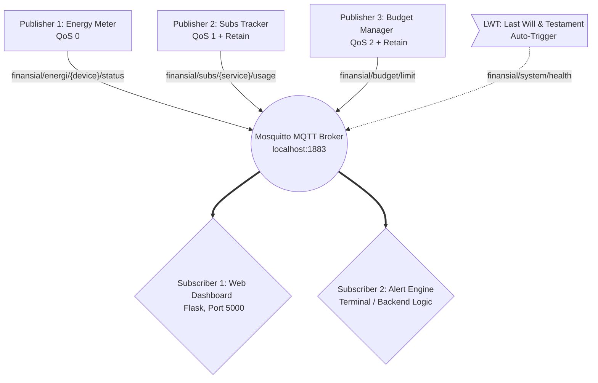

# 🚀 Smart Finance & Energy Orchestrator - Demo Presentation

## 1. Deskripsi Singkat Projek
**Smart Finance & Energy Orchestrator** adalah sebuah sistem pemantauan keuangan dan penggunaan energi secara *real-time* berbasis **protokol MQTT**. 

Sistem ini didesain menggunakan arsitektur terdistribusi (Publisher-Subscriber) yang mensimulasikan manajemen rumah atau gedung pintar. Proyek ini mendemonstrasikan implementasi level lanjut dari MQTT termasuk **QoS (Quality of Service) Level 0, 1, dan 2**, **Topik Wildcard**, **Retained Messages**, **Last Will and Testament (LWT)**, dan mekanisme **Keep Alive**.

Komponen utama sistem ini meliputi:
- **Broker**: Mosquitto MQTT Broker sebagai server utama.
- **Publishers**: 
  1. Energy Meter (Mensimulasikan data pemakaian listrik secara konstan).
  2. Subs Tracker (Melaporkan data tagihan langganan bulanan).
  3. Budget Manager (Input interaktif untuk menetapkan batas anggaran).
- **Subscribers**:
  1. Web Dashboard Interaktif (Flask + Chart.js via WebSockets).
  2. Automation & Alert Engine (Mesin backend pendeteksi anomali/notifikasi).

---

## 2. Arsitektur Sistem

Berikut adalah alur komunikasi antar komponen dalam arsitektur sistem:



---

## 3. Design Topic (Topic Tree)

Sistem MQTT tidak menggunakan URL seperti API tradisional, melainkan menggunakan rute berbasis string yang disebut **Topik**. Struktur topik (*Topic Tree*) pada proyek ini dirancang secara hierarkis (menyerupai folder direktori komputer) dengan *root namespace* `finansial/`.

Desain berjenjang ini disusun secara spesifik untuk memaksimalkan fitur **Wildcard** dan membedakan jaminan pengiriman (QoS) berdasarkan urgensi datanya.

```text
finansial/
├── energi/
│   ├── pc/
│   │   └── status      [QoS 0]
│   ├── lampu/
│   │   └── status      [QoS 0]
│   ├── ac/
│   │   └── status      [QoS 0]
│   └── kulkas/
│       └── status      [QoS 0]
│
├── subs/
│   ├── netflix/
│   │   └── usage       [QoS 1, Retained]
│   ├── internet/
│   │   └── usage       [QoS 1, Retained]
│   └── listrik/
│       └── usage       [QoS 1, Retained]
│
├── budget/
│   └── limit           [QoS 2, Retained]
│
├── system/
│   └── health          [LWT: "Metering Offline"]
│
└── alerts/
    └── warning         [QoS 1]
```

### Penjelasan Desain Topik:
1. **Root Namespace (`finansial/`)**: Menyatukan seluruh ekosistem proyek agar terisolasi dan tidak bertabrakan dengan pesan dari sistem IoT lain jika dijalankan di broker Publik yang sama.
2. **Level Kategori (`energi/`, `subs/`, `budget/`)**: Memisahkan lalu lintas data berdasarkan karakteristik lalu lintas dan kepentingannya.
   - Kategori `energi` menghasilkan *traffic* sangat tinggi dan stabil setiap detik, sehingga dioptimalkan menggunakan **QoS 0** (cepat, ringan, tanpa garansi).
   - Kategori `subs` (langganan) dan `budget` adalah data finansial administratif. *Traffic*-nya sangat rendah tapi butuh keakuratan absolut. Oleh karena itu, `subs` dilindungi **QoS 1** (pasti sampai) dan `budget` diproteksi ketat dengan **QoS 2** (pasti sampai 1x, terbebas dari bug duplikasi). Keduanya sengaja disematkan fitur **Retained** agar broker senantiasa mengingat nilai finansial tersebut untuk pengunjung web yang baru terhubung.
3. **Level Identitas (Penempatan Wildcard)**: Level ketiga berisi nama entitas unik (`pc`, `lampu`, `netflix`). Level ini dirancang sengaja sejajar mendatar agar fitur *Wildcard* dapat diaktifkan. Web Dashboard cukup berlangganan ke **`finansial/energi/+/status`**. Karakter `+` (*Single-Level Wildcard*) bertugas menyapu seluruh perangkat di level identitas tersebut. Dengan desain ini, jika di masa depan kita menghubungkan *Mesin Cuci Pintar* baru, grafiknya akan otomatis muncul di dashboard tanpa merubah satu baris *code* pun.
4. **Level Aksi/Kondisi (`status`, `usage`, `limit`)**: Ujung daun (*leaf*) yang secara spesifik menjelaskan isi *payload* dari pesan (JSON) tersebut.

---

## 4. Fitur-Fitur Utama MQTT & Penjelasan

### A. Last Will and Testament (LWT)
* **Konsep:** Saat terhubung ke broker, sebuah *client* dapat "menitipkan pesan wasiat". Broker akan otomatis mem-publish pesan tersebut hanya jika klien terputus secara tidak wajar (misal program *crash* atau jaringan putus).
* **Implementasi:** *Energy Meter* mendaftarkan pesan wasiat di topik `finansial/system/health`.
* **Cara Demo / Hasil:** Matikan paksa terminal `publisher_energy_meter.py` (Ctrl+C). Web Dashboard dan *Alert Engine* akan langsung menerima notifikasi `"Metering Offline"` dan merubah status sistem.
> *[ 📸 TEMPATKAN SCREENSHOT HASIL: Terminal Alert Engine mendeteksi Offline & Status Dashboard menjadi merah ]*

### B. QoS Level (Quality of Service)
MQTT mendukung garansi pengiriman pesan dalam 3 tingkatan. Sistem ini menerapkan ketiganya pada tempat yang tepat:
* **QoS 0 (Fire & Forget):** Digunakan pada data **Energy Meter**. Datanya mengalir sangat cepat setiap detik. Jika ada satu atau dua data yang hilang (lost packet), tidak apa-apa dan tidak menyebabkan kerusakan krusial.
* **QoS 1 (At Least Once):** Digunakan pada **Subs Tracker**. Status layanan bulanan harus dijamin masuk minimal satu kali karena menyangkut tagihan pembayaran yang tidak boleh terlewat.
* **QoS 2 (Exactly Once):** Digunakan pada **Budget Manager**. Pengaturan batas pengeluaran sangat krusial. Menggunakan proses *4-way handshake* di sistem agar terhindar dari duplikasi (*double update*) data anggaran.
> *[ 📸 TEMPATKAN SCREENSHOT HASIL: Log pada terminal Mosquitto (mode -v) yang menampilkan PUBREC, PUBREL, dan PUBCOMP saat Budget Manager diaktifkan ]*

### C. Retained Message
* **Konsep:** Pesan terakhir dari suatu topik disimpan oleh broker di dalam memori.
* **Implementasi:** Jika Web Dashboard terlambat dinyalakan, ia tetap akan langsung mendapatkan data *Budget* dan *Subscription* terakhir sesaat setelah terkoneksi. Klien baru tidak perlu menunggu sampai *publisher* melakukan pengiriman data di iterasi berikutnya.
> *[ 📸 TEMPATKAN SCREENSHOT HASIL: Tampilan Dashboard langsung memuat angka Limit Budget setelah menekan tombol Refresh Browser ]*

### D. Single-Level Wildcard (+)
* **Konsep:** Karakter `+` dapat digunakan *subscriber* untuk berlangganan pada satu level topik secara dinamis.
* **Implementasi:** Dashboard *subscribe* ke topik `finansial/energi/+/status`. Alhasil, tanpa *coding* satu per satu, Dashboard langsung bisa menangkap data daya PC, daya Lampu, daya AC, dan daya Kulkas secara bersaaman.
> *[ 📸 TEMPATKAN SCREENSHOT HASIL: Output terminal web dashboard menerima data energi dari berbagai device berbeda secara berurutan ]*

### E. Keep Alive
* **Konsep:** Mekanisme "Cek Denyut Nadi" antara klien dan broker.
* **Implementasi:** Menggunakan interval 10 detik. Jika klien *idle*, ia mengirimkan sinyal ping. Jika broker tidak menerima *PINGREQ* dari *Energy Meter* lebih dari interval + toleransi waktu, broker menganggap koneksi mati dan melepaskan sinyal LWT.
> *[ 📸 TEMPATKAN SCREENSHOT HASIL: Terminal Mosquitto menunjukkan lalu lintas PINGREQ dan PINGRESP antar client dan broker ]*

---

## 5. Web Dashboard Overview (Subscriber)

*Web Dashboard* bertindak sebagai MQTT Subscriber yang memvisualisasikan data ke tampilan tatap muka menggunakan SocketIO agar web browser dapat secara asinkron menangkap data MQTT.

### A. Real-Time Energy Monitoring (Area Chart)
* **Penjelasan:** Menampilkan pergerakan grafik dinamis (*Chart.js*) hasil kiriman nilai arus dan tegangan berkecepatan tinggi dari publisher QoS 0.
> *[ 📸 TEMPATKAN SCREENSHOT HASIL: Potongan gambar bagian grafik bar/garis Chart.js di Dashboard yang sedang berfluktuasi ]*

### B. Indikator Budget & Subscription (Card Panel)
* **Penjelasan:** Panel statis tapi responsif yang menampilkan angka batas limit yang dikirimkan dengan garansi tinggi menggunakan QoS 2. Didukung oleh *Retained Messages* sehingga angkanya selalu *up-to-date*.
> *[ 📸 TEMPATKAN SCREENSHOT HASIL: Potongan gambar indikator Total Tagihan Langganan vs Limit Budget Keuangan di Dashboard ]*

### C. System Health Indicator (Reaktif UI)
* **Penjelasan:** Label di pojok dashboard yang merespon secara instan pesan wasiat (LWT) dari sistem untuk menampilkan status visual konektivitas *Hardware*.
> *[ 📸 TEMPATKAN SCREENSHOT HASIL: Indikator bertuliskan "Connected" (Warna Hijau) dan "Disconnected/Offline" (Warna Merah) pada layar Dashboard ]*
